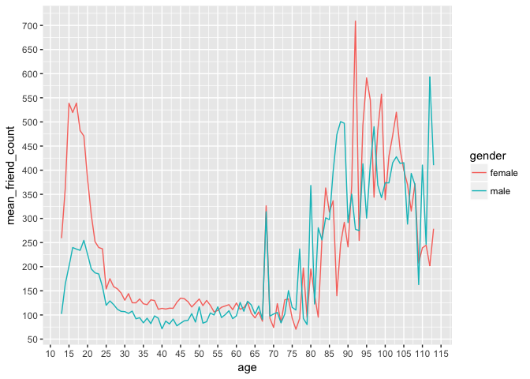
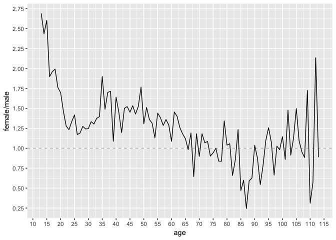

Lesson 7: Explore Many Variables
================
Dannyel Cardoso da Fonseca
2017-11-25

### Load Libraries and Data

``` r
library(ggplot2)
library(dplyr, warn.conflicts = FALSE)

pf <- read.delim('data/pseudo_facebook.tsv')
```

### Third Qualitative Variable

``` r
pf.fc_by_age_gender <- pf %>% 
                          filter(!is.na(gender)) %>% 
                          group_by(age, gender) %>% 
                          summarise(mean_friend_count = mean(friend_count),
                                    median_friend_count = as.integer(median(friend_count)),
                                    n = n()) %>%                   
                          ungroup() %>% 
                          arrange(age, gender)

head(pf.fc_by_age_gender)
```

    ## # A tibble: 6 x 5
    ##     age gender mean_friend_count median_friend_count     n
    ##   <int> <fctr>             <dbl>               <int> <int>
    ## 1    13 female          259.1606                 148   193
    ## 2    13   male          102.1340                  55   291
    ## 3    14 female          362.4286                 224   847
    ## 4    14   male          164.1456                  92  1078
    ## 5    15 female          538.6813                 276  1139
    ## 6    15   male          200.6658                 106  1478

### Plotting Conditional Summaries

``` r
ggplot(pf.fc_by_age_gender, aes(x = age, y = mean_friend_count)) +
  geom_line(aes(color = gender)) +
  scale_x_continuous(breaks = seq(10, 115, 5)) +
  scale_y_continuous(breaks = seq(0, 750, 50))
```



### Reshaping Data

``` r
library(tidyr)
pf.fc_by_age_gender.wide <- pf.fc_by_age_gender %>% 
                               select(age, gender, median_friend_count) %>% 
                               spread(gender, median_friend_count)

head(pf.fc_by_age_gender.wide)
```

    ## # A tibble: 6 x 3
    ##     age female  male
    ##   <int>  <int> <int>
    ## 1    13    148    55
    ## 2    14    224    92
    ## 3    15    276   106
    ## 4    16    258   136
    ## 5    17    245   125
    ## 6    18    243   122

### Ratio Plot

``` r
ggplot(pf.fc_by_age_gender.wide, aes(x = age, y = female/male)) +
  geom_line() +
  geom_hline(yintercept = 1, linetype = 2, alpha = .3) +
  scale_x_continuous(breaks = seq(10, 115, 5)) +
  scale_y_continuous(breaks = seq(0, 4.5, .25))
```



### Third Quantitative Variable

``` r
pf$year_joined <- 2014 - ceiling(pf$tenure/365)
```

### Cut a Variable
