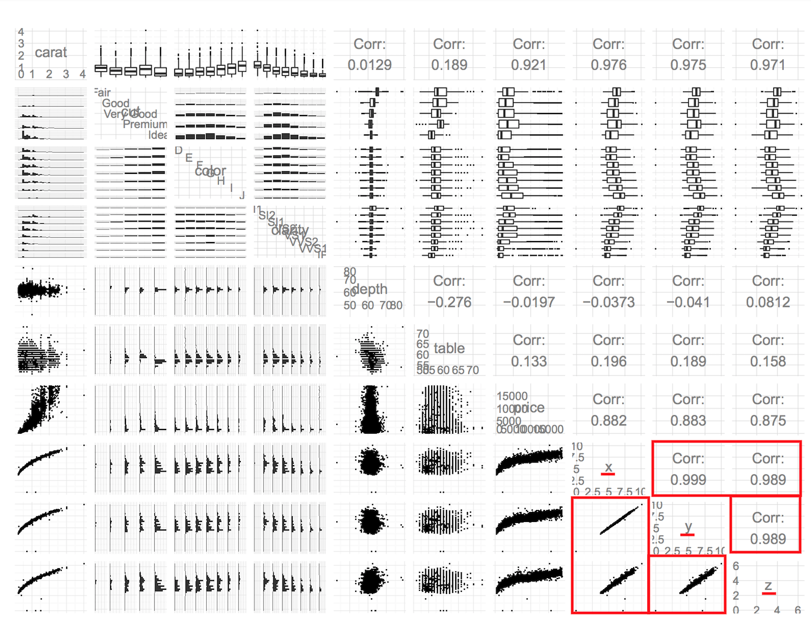
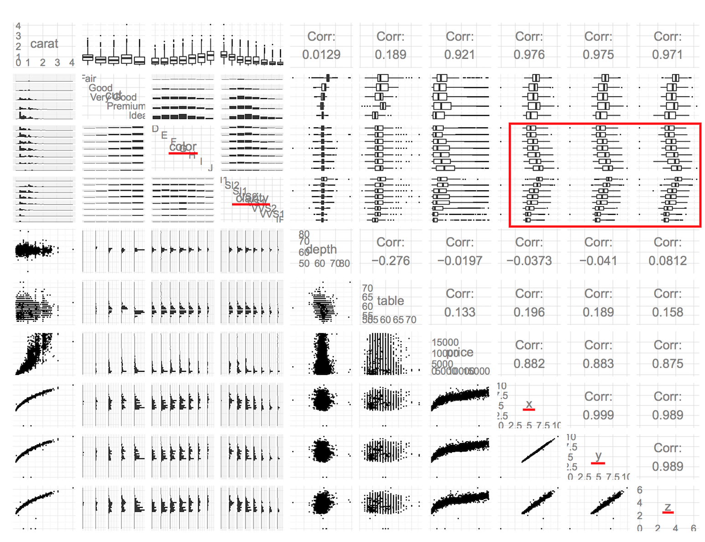
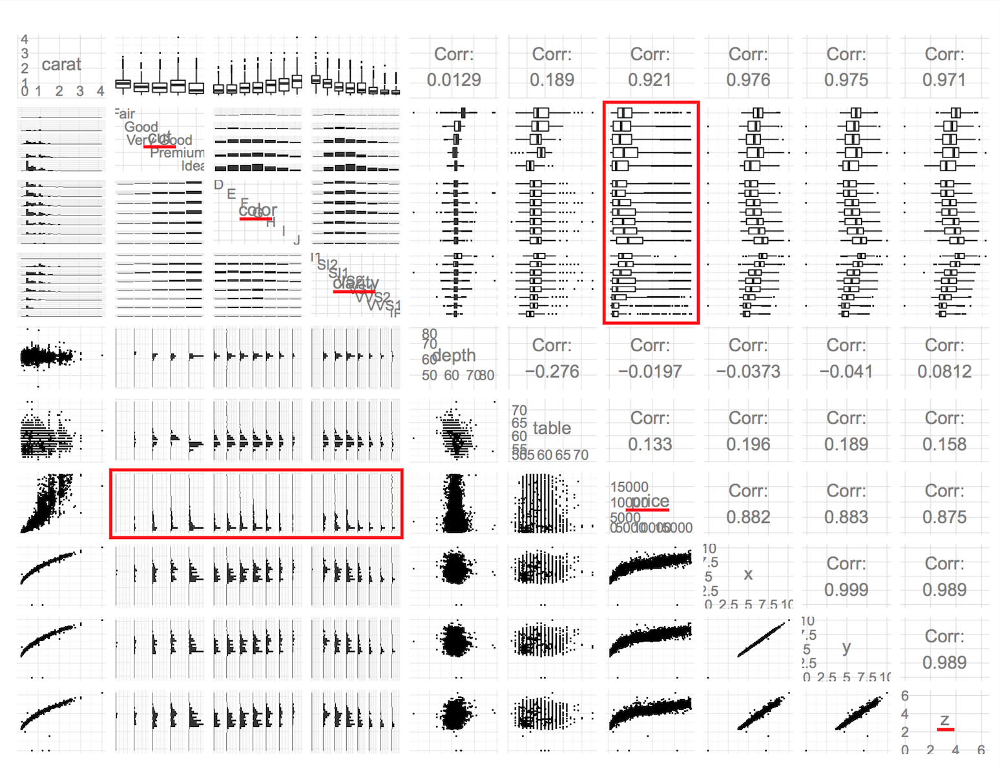

```{r echo=FALSE}
setwd("~/Documents/GitHub/udacity-dand/core-course-05-exploratory-data-analysis/lesson-09-diamonds-and-price-predictions")
```

### Load Libraries and Datasets

```{r Load Libraries and Datasets}
library(ggplot2, warn.conflicts = FALSE)
library(gridExtra, warn.conflicts = FALSE)
library(GGally, warn.conflicts = FALSE)
library(scales, warn.conflicts = FALSE)
library(RColorBrewer, warn.conflicts = FALSE)
library(lattice, warn.conflicts = FALSE)
library(MASS, warn.conflicts = FALSE)
suppressWarnings(library(memisc, warn.conflicts = FALSE))
theme_set(theme_light())

data(diamonds)
diamondsbig <- read.csv('lesson_09_files/data/diamondsbig.csv')
```

### Welcome!
> Note: https://www.youtube.com/watch?v=KJT4Z0xpHns

### Linear Regression Models
> Note: In this lesson, Solomon will be using a linear regression model to predict diamond price using other variables in the diamonds dataset. If you are not familiar with linear regression, you may want to take a break and go through [Lesson 18 of Udacity's Intro to Inferential Statistics](https://classroom.udacity.com/courses/ud201/lessons/1309228537/concepts/1822138740923) course, which covers linear regression. When you're done, you'll be ready to come back and apply your new knowledge to the diamonds dataset!

### Scatterplot Review
> Note: https://www.youtube.com/watch?v=W96zaGEma7o

**Quiz:** Let's start by examining two variables in the data set. The scatterplot is a powerful tool to help you understand the relationship between two continuous variables.

We can quickly see if the relationship is linear or not. In this case, we can use a variety of diamond characteristics to help us figure out whether the price advertised for any given diamond is reasonable or a rip-off.

Let's consider the price of a diamond and it's carat weight. Create a scatterplot of price (y) vs carat weight (x).

Limit the x-axis and y-axis to omit the top 1% of values.

**Response:** 
```{r Scatterplot Review}
ggplot(diamonds, aes(x = carat, y = price)) +
  geom_point(alpha = 1/10, na.rm = TRUE) +
  scale_x_continuous(limits = c(0, quantile(diamonds$carat, .99)),
                     breaks = seq(0, 2.5, 0.25)) +
  scale_y_continuous(limits = c(0, quantile(diamonds$price, .99)),
                     breaks = seq(0, 20000, 1500))
```

### Price and Carat Relationship
> Note: https://www.youtube.com/watch?v=gG4xwgj1yVA

**Quiz:** What do you notice about the relationship between price and carat?

**Response:** Apparently, as carat increases the price increase as well, in a non-linear way. As carat increases price dispersion increases as well.
```{r Price and Carat Relationship}
ggplot(diamonds, aes(x = carat, y = price)) +
  geom_point(alpha = 1/10, na.rm = TRUE) +
  geom_smooth(method = "lm", na.rm = TRUE) +
  scale_x_continuous(limits = c(0, quantile(diamonds$carat, .99)),
                     breaks = seq(0, 2.5, 0.25)) +
  scale_y_continuous(limits = c(0, quantile(diamonds$price, .99)),
                     breaks = seq(0, 20000, 1500))
```

### Frances Gerety
> Note: https://www.youtube.com/watch?v=GXT_vXBA0vQ

**Quiz:** Frances Gerety coined a famous slogan.

**Response:** "A diamond is forever."

### The Rise of Diamonds
> Note: https://www.youtube.com/watch?v=MD9RIDRVc-A

### ggpairs Function
> Note: https://www.youtube.com/watch?v=iJEBxsKDDoE

**Quiz:** What do you notice in the plot matrix from the ggpairs() function?

    # sample 10,000 diamonds from the data set.
    set.seed(20022012)
    diamond_samp <- diamonds[sample(1:length(diamonds$price), 10000), ]
    ggpairs(diamond_samp, axisLabels = 'internal',
      lower = list(continuous = wrap("points", shape = I('.'))),
      upper = list(combo = wrap("box", outlier.shape = I('.'))))

{width="75%"}

**Response:**

* **Relationship among x y and z dimensions**: it is obvious that there is a strong correlation among dimensions of diamond. That correlation is linear. As one dimension increases the others increase as well, in the same proportion.

{width="75%"}

* **Relationship between price and diamond dimensions**: in data set, apparently, there is a strong correlation between price and diamond dimensions. That correlation appears to be logarithmic.

{width="75%"}

* **Relationship of carat with color and clarity**: in data set, weightiest diamonds have worst colour and worst clarity. But the worst color diamonds are proportionately in smaller quantity while the diamonds of color clarity are proportionately in greater quantity. Summing up, the best clarity diamonds there are in smaller quantity and tend to be lighter and have better color.

{width="75%"}

* **Relationship among carat, price and diamond dimensions**: in data set, there is a strong correlation among carat, price and diamond dimensions. The correlation seems to be exponential between carat and diamond price and appears to be logarithmic between carat and diamond dimensions.

{width="75%"}

* **Relationship among color, clarity and diamond dimensions**: in data set, there is a certain correlation among color, clarity and diamond dimensions. This can be seen in the faceted boxplot. Diamonds with larger dimensions tend to have worst colors and clarities while diamonds with smaller dimensions tend to have best colors and clarities.

{width="75%"}

* **Relationship among price, cut, color and clarity**: in data set, apparently, there is no significant correlation among price, cut, color and clarity. There is a little variability in the faceted bloxplots and faceted histogram.

{width="75%"}

### The Demand of Diamonds
> Note: https://www.youtube.com/watch?v=h-YgETh80h4

**Quiz:** Create two histograms of the price variable and place on one output image. 

The first plot should be a histogram of price and the second plot should transform the price variable using log10.

**Response:** 
```{r The Demand of Diamonds}
p1 <- ggplot(diamonds, aes(x = price)) +
        geom_histogram(bins = 30) +
        scale_x_continuous(breaks = seq(0, 20000, 1500)) +
        scale_y_continuous(breaks = seq(0, 15000, 2000)) +
        ggtitle('Price')

p2 <- ggplot(diamonds, aes(x = price)) +
        geom_histogram(bins = 30) +
        scale_x_log10() +
        scale_y_continuous(breaks = seq(0, 4000, 500)) +
        ggtitle('Price (log10)')

grid.arrange(p1, p2)
```

### Connecting Demand and Price Distribution
> Note: https://www.youtube.com/watch?v=Rj6g9jpX9MQ

**Quiz:** When looking at these plots, what do you notice? Think specifically about the two peaks in the transformed plot and how it relates to the demand for diamonds.

**Response:** I notice that about half of diamonds have prices that are below $3,000. Above this value, diamond prices disperse into a long tail in the histogram. After log10 transformation I notice that the long tail is highly representative appearing to be the majority of diamond prices. The target audience of the first peak is the large mass of people, with lower purchasing power. Already the target audience of the second peak are people with greater purchasing power and who seeks to differentiate themselves from the great mass of people.

### Scatterplot Transformation
> Note: https://www.youtube.com/watch?v=h1wbEPuADz0

```{r Scatterplot Transformation}
# carat = weight of the diamond = f(volume) = f(x.y.z)
cuberoot_trans <- function() {
  trans_new("cuberoot",
            transform = function(x) x ^ (1/3), # cubic root
            inverse = function(x) x ^ 3)
}

ggplot(diamonds, aes(x = carat, y = price)) +
  geom_point(na.rm = TRUE) +
  scale_x_continuous(trans = cuberoot_trans(), 
                     limits = c(.2, 3),
                     breaks = c(.2, .5, 1, 2, 3)) +
  scale_y_continuous(trans = log10_trans(), 
                     limits = c(350,15000),
                     breaks = c(350, 1000, 5000, 10000, 15000)) +
  ggtitle("Price (log10) by cube root of carat")
```

### Overplotting Revisited
> Note: https://www.youtube.com/watch?v=P6ZOr7JiMLk

**Quiz:** Add a layer to adjust the features of the scatterplot. Set the transparency to one half, the size to three-fourths, and jitter the points.

**Response:** 
```{r Overplotting Revisited}
ggplot(diamonds, aes(x = carat, y = price)) +
  geom_point(alpha = 1/2, size = 3/4, position = position_jitter(), na.rm = TRUE) +
  scale_x_continuous(trans = cuberoot_trans(), 
                     limits = c(.2, 3),
                     breaks = c(.2, .5, 1, 2, 3)) +
  scale_y_continuous(trans = log10_trans(), 
                     limits = c(350,15000),
                     breaks = c(350, 1000, 5000, 10000, 15000)) +
  ggtitle("Price (log10) by cube root of carat")
```

### Plot Colors for Qualitative Factors
> Note: https://www.youtube.com/watch?v=2ZVGl6LrOPw

### Price vs. Carat and Clarity
> Note: https://www.youtube.com/watch?v=J0Ls7F-lN4o

**Quiz:** Adjust the code below to color the points by clarity.

A layer called scale_color_brewer() has been added to adjust the legend and provide custom colors.

**Response:**
```{r Price vs. Carat and Clarity}
ggplot(diamonds, aes(x = carat, y = price, color = clarity)) +
  geom_point(alpha = 1/2, size = 3/4, position = position_jitter(), na.rm = TRUE) +
  scale_color_brewer(type = 'div',
                     guide = guide_legend(title = 'Clarity', 
                                          reverse = TRUE,
                                          override.aes = list(alpha = 1, size = 2))) +
  scale_x_continuous(trans = cuberoot_trans(), 
                     limits = c(.2, 3),
                     breaks = c(.2, .5, 1, 2, 3)) +
  scale_y_continuous(trans = log10_trans(), 
                     limits = c(350,15000),
                     breaks = c(350, 1000, 5000, 10000, 15000)) +
  ggtitle('Price (log10) by Cube-Root of Carat and Clarity')
```

### Clarity and Price
> Note: https://www.youtube.com/watch?v=UnkrtPPx9-c

**Quiz:** Based on the plot, do you think clarity explain some of the change in price? Why?

**Response:** Yes! The dispersion of the price in a given carat is explained by the clarity of the diamond. The best clarity is more expensive than the worst clarity in a given carat.

### Price vs Carat and Cut
> Note: https://www.youtube.com/watch?v=RF9V7l00a28

**Quiz:** Let’s look at cut and see if we find a similar result.

**Response:**
```{r Price vs Carat and Cut}
ggplot(diamonds, aes(x = carat, y = price, color = cut)) +
  geom_point(alpha = 1/2, size = 3/4, position = position_jitter(), na.rm = TRUE) +
  scale_color_brewer(type = 'div',
                     guide = guide_legend(title = 'Cut', 
                                          reverse = TRUE,
                                          override.aes = list(alpha = 1, size = 2))) +
  scale_x_continuous(trans = cuberoot_trans(), 
                     limits = c(.2, 3),
                     breaks = c(.2, .5, 1, 2, 3)) +
  scale_y_continuous(trans = log10_trans(), 
                     limits = c(350,15000),
                     breaks = c(350, 1000, 5000, 10000, 15000)) +
  ggtitle('Price (log10) by Cube-Root of Carat and Cut')
```

### Cut and Price
> Note: https://www.youtube.com/watch?v=MZyle39D5Ks

**Quiz:** Based on the plot, do you think cut accounts some of the change in price? Why?

**Response:** Practically not! In the dispersion of the price in a given carat, the Ideal and Premium predominate since the lowest price until the highest price. 

### Price vs Carat and Color
> Note: https://www.youtube.com/watch?v=ow70HVqX4OY

**Quiz:** Finally, let’s use diamond color to color our plot.

**Response:**
```{r Price vs Carat and Color}
ggplot(diamonds, aes(x = carat, y = price, color = color)) +
  geom_point(alpha = 1/2, size = 3/4, position = position_jitter(), na.rm = TRUE) +
  scale_color_brewer(type = 'div',
                     guide = guide_legend(title = 'Color', 
                                          override.aes = list(alpha = 1, size = 2))) +
  scale_x_continuous(trans = cuberoot_trans(), 
                     limits = c(.2, 3),
                     breaks = c(.2, .5, 1, 2, 3)) +
  scale_y_continuous(trans = log10_trans(), 
                     limits = c(350,15000),
                     breaks = c(350, 1000, 5000, 10000, 15000)) +
  ggtitle('Price (log10) by Cube-Root of Carat and Color')
```

### Color and Price
> Note: https://www.youtube.com/watch?v=-9CHGW25yMg

**Quiz:** Based on the plot, do you think that the diamond color influences price? Why?

**Response:** Yes! Color influences prices in the same way that clarity do. The diamond with best color is more expensive than diamond with the worst color in a given carat.
 
### Linear Models in R
> Note: https://www.youtube.com/watch?v=a2GCyz_N0oY

{width="75%"}

### Building the Linear Model
> Note: https://www.youtube.com/watch?v=zyIc0sXYk2A

```{r Building the Linear Model}
m1 <- lm(I(log(price)) ~ I(carat^(1/3)), data = diamonds)
m1 

m2 <- update(m1, ~ . + carat)
m2

m3 <- update(m2, ~ . + cut)
m3

m4 <- update(m3, ~ . + color)
m4

m5 <- update(m4, ~ . + clarity)
m5

mtable(m1, m2, m3, m4, m5, sdigits = 3)
```

### Model Problems
> Note: https://www.youtube.com/watch?v=Och80L_uNjU

**Quiz:** What could be some problems when using this model? What else should we think about when using this model?

**Response:**

> Note: https://www.youtube.com/watch?v=MV_e0z9kFjM

"To start, this data is from 2008. When I fitted models using this data and predicted the price of the diamonds that I found in the market, I kept getting predictions that were way too low. After some additional digging, I found that global diamonds were poor. It turns out that prices plummeted in 2008 due to the global financial crisis and since then, prices at least for wholesale polished diamonds, have grown at about 6% per year, compound annual rate... And finally, after looking at the data on price scope, I realized that diamond prices grew unevenly across different karat sizes since 2008. Therefore, the initially estimated model could not simply be adjusted by inflation."

### A Bigger, Better Data Set
> Note: https://www.youtube.com/watch?v=q46nO0mznXM

**Quiz:** Your task is to build five linear models like Solomon did for the diamonds data set only this time you'll use a sample of diamonds from the diamondsbig data set.

Since the data set is so large, you are going to use a sample of the data set to compute the models. You can use the entire data set on your machine which will produce slightly different coefficients and statistics for the models.

Be sure to make use of the same variables (logprice, carat, etc.) and model names (m1, m2, m3, m4, m5).

**Response:**
```{r A Bigger, Better Data Set}
# Only want GIA Certified diamonds that are under $10,000
diamondsbig.filtered <- diamondsbig[diamondsbig$price < 10000 & diamondsbig$cert == "GIA",]

# Sample from this large dataset
set.seed(20022012)
diamondsbig.sample <- diamondsbig.filtered[sample(1:nrow(diamondsbig.filtered), 10000), ]

m1 <- lm(I(log(price)) ~ I(carat^(1/3)), data = diamondsbig.sample)
m1 

m2 <- update(m1, ~ . + carat)
m2

m3 <- update(m2, ~ . + cut)
m3

m4 <- update(m3, ~ . + color)
m4

m5 <- update(m4, ~ . + clarity)
m5

mtable(m1, m2, m3, m4, m5, sdigits = 3)
```

### Predictions
> https://www.youtube.com/watch?v=hW_1ASU-j8A

**Quiz:** Example diamond from BlueNile:
> Note: Round 1.00 Very Good I VS1 $5,601

```{r Predictions}
this.diamond = data.frame(carat = 1.00, cut = "V.Good", color = "I", clarity = "VS1")
this.diamond

model.estimate = predict(m5, newdata = this.diamond, interval = "prediction", level = .95)
model.estimate

exp(model.estimate)
```

Evaluate how well the model predicts the BlueNile diamond's price. Think about the fitted point estimate as well as the upper and lower bound of the 95% CI.

**Response:** The example diamond is a touch pricier than expected value by the full model.

> Note: The prediction interval here may be slightly conservative, as the model errors are heteroskedastic over carat (and hence price) even after our log and cube-root transformations. See the output of the following code.

```{r Predictions 2}
summary(m4)

dat = data.frame(m4$model, m4$residuals)
head(dat)

with(dat, sd(m4.residuals))
with(subset(dat, carat > .9 & carat < 1.1), sd(m4.residuals))

dat$resid <- as.numeric(dat$m4.residuals)

ggplot(dat, aes(x = round(carat, 2), y = resid)) +
  geom_line(stat = "summary", fun.y = sd, na.rm = TRUE) +
  scale_x_continuous(breaks = seq(0, 2.5, .1))

ggplot(subset(dat, carat > .9 & carat < 1.1), aes(x = round(carat, 2), y = resid)) +
  geom_line(stat = "summary", fun.y = sd, na.rm = TRUE) +
  scale_x_continuous(breaks = seq(0, 2, .01))
```

How could we do better? If we care most about diamonds with carat weights between 0.50 and 1.50, we might restrict the data we use to fit our model to diamonds that are that size - we have enough data.