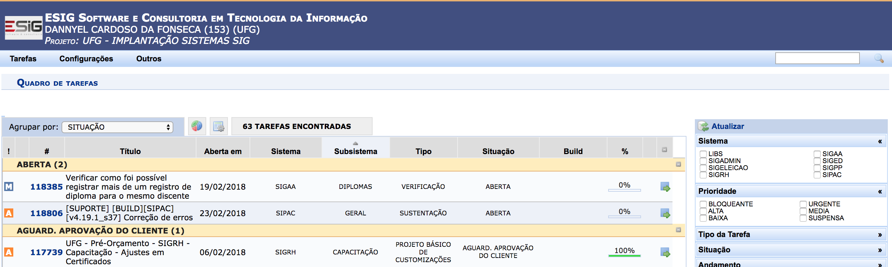

# EDA in an Issue Tracking System Data Set

*by Dannyel Cardoso da Fonseca*

This project aims to explore a data set containing 22125 observations of
issues tracking and their history logs. The data set represents 5 years
of project management which aimed maintenance and customization of many
integrated systems ([SIG](https://docs.info.ufrn.br)) for the academic,
administrative and human resources management at the Universidade
Federal de Goiás ([UFG](https://www.ufg.br)).

A proprietary issue tracking system
([SIGProject](https://sigproject.esig.com.br)) was used to manage
activities of company ([ESIG](https://www.esig.com.br)) and client
([Cercomp](https://www.cercomp.ufg.br))
teams.

I used data wrangling techniques to export data from that and clean
them. The final data set, used in this project, and its documentation
can be accessed, respectively, in these links:

  - [Issues Data Set](issues_tracking.csv)
  - [Issues Data Set Documentation](issues_tracking.Rdoc.txt)

The exported data set, the wrangling process scripts and an example of
one issue tracking can be find in [data\_wrangling](data_wrangling)
folder.

# Initial Descriptive Analysis

In this section, we perform a univariate exploration of the data set,
first examining its structure, followed by the analysis of each variable
starting with issue variables and ending with log variables. In each
group (issue and log) I begin with exploration of temporal variables and
end with the analysis of categorical and range variables.

### Data Set Structure

The issues data set contains 22125 rows and 24 variables. Of these 24
variables 16 are about issue data and 8 about issue’s logs.

    ## Observations: 22,125
    ## Variables: 24
    ## $ issue_id              <int> 487247, 487247, 487247, 487247, 487247, ...
    ## $ issue_number          <int> 88374, 88374, 88374, 88374, 88374, 74486...
    ## $ issue_title           <chr> "Tarefa 88374 - Alteração de Financiamen...
    ## $ issue_type            <fct> CUSTOMIZATION, CUSTOMIZATION, CUSTOMIZAT...
    ## $ issue_creation_date   <dttm> 2016-12-15 15:07:32, 2016-12-15 15:07:3...
    ## $ issue_system          <fct> SIGAA, SIGAA, SIGAA, SIGAA, SIGAA, SIGRH...
    ## $ issue_start_date      <date> 2016-12-20, 2016-12-20, 2016-12-20, 201...
    ## $ issue_subsystem       <fct> EXTENSÃO, EXTENSÃO, EXTENSÃO, EXTENSÃO, ...
    ## $ issue_deadline_date   <date> 2017-01-03, 2017-01-03, 2017-01-03, 201...
    ## $ issue_created_by      <chr> "HELENA CLAUDIA DOS SANTOS TEIXEIRA", "H...
    ## $ issue_stakeholder     <fct> COMPANY, COMPANY, COMPANY, COMPANY, COMP...
    ## $ issue_status          <fct> FINISHED, FINISHED, FINISHED, FINISHED, ...
    ## $ issue_time_spent      <int> 360, 360, 360, 360, 360, 51120, 51120, 5...
    ## $ issue_priority_number <int> 999, 999, 999, 999, 999, 999, 999, 999, ...
    ## $ issue_progress        <int> 100, 100, 100, 100, 100, 100, 100, 100, ...
    ## $ issue_priority_scale  <fct> HIGH, HIGH, HIGH, HIGH, HIGH, HIGH, HIGH...
    ## $ log_build_info        <chr> NA, NA, "SIGAA-4.1.140.ufg", NA, NA, NA,...
    ## $ log_creation_date     <dttm> 2017-04-10 17:07:00, 2017-04-04 11:55:0...
    ## $ log_action            <fct> ISSUE ALTERATION, RESPONSE TO STAKEHOLDE...
    ## $ log_status            <fct> FINISHED, CUSTOMER CLOSING PENDING, REQU...
    ## $ log_progress          <int> 100, 100, 90, 90, 0, 100, 100, 100, 100,...
    ## $ log_time_spent        <int> NA, NA, 60, NA, NA, NA, NA, NA, NA, NA, ...
    ## $ log_created_by        <chr> "ROSANGELA DIVINA DE SOUSA SANTANA", "RE...
    ## $ log_svn_revision      <int> NA, NA, NA, NA, NA, NA, NA, NA, NA, NA, ...

The number of distinct issues rows and issue’s logs rows are 4503 and
21978 respectively. That is, the number of issues represents 20% of the
data set and the number of logs represents 99% of it. The 1% of logs
remaining (147 rows) represents issues that do not have history logs.

The distribution and the summaries of number of logs per issue are
ploted in the histogram
below.

> **Note:** In the plot above, the black dashed lines represent the 1st
> and 3rd quartile, the black and red solid lines represent,
> respectivaly, median and mean and the black dotted line represent the
> upper threshold to the outliers (3rd qu. + 1.5 IQR).

Analysing the plot above, we can note that most of issues have between 1
and 9 history logs, approximately 1 standard deviation from the mean.
Also, 75% of them have up to 6 history logs and 50% of issues have
between 2 and 6 logs, a narrow range. Despite the skewed shape of plot,
the median and mean are very close. This means that the amount of
ouliers, after 12 logs per issue, is very low, approximately 4% of
issues.

The representative narrow range of logs in an issue makes us think that
there shoud be an activity flow pattern to resolve an issue. This flow
pattern migth be observed in a commom sequence of log status. See more
informations in the [Log Status](#log-status) section.

### Issue Creation Date

The data set analyzed comprises issues created in the period between
05/21/2013 and 01/26/2018. More precisaly, between 19:10:24 of
05/21/2013 and 16:16:06 of 01/26/2018.

To get a sense of how it was the demand throughout the project see the
plot below that shows the cumulative number of issues created per month
along the project and its trend
line.

> **Note:** In the plot above, the blue solid line represents the trend
> of the data and dotted grey vertical lines represent the 1st day of
> year.

We note that the first 11 months (from May 2013 to March 2014) of the
project had very low demand, approximately 4% of the total. Some reasons
for this were:

  - The customer and company teams were small;
  - There were no defined work processes between customer and company;
  - That was the first time that the customer outsourced the development
    and deployment of systems;
  - The customer’s team had no experience with systems being deployed
    and the company’s team did not know the customer’s day-to-day
    business deeply.

The work processes and knowledge on both sides (customer and company)
were being built over those 11 months. The teams grew in size and new
modules started development and deployment. The next 12 months (from
April 2014 to March 2015) there was significant growth curve in the
activities, approximately 25% of growth over the previous 11 months.
From June 2015 the activities growth seems to stabilize, sometimes
taking small growth curves. In this period occurred approximately 65% of
project activities. Besides, the trend line fitted with growth curve
demonstrating that the project began to have a standardized behavior.

In the area plot below, we can see the project’s behavior in another
way. This plot shows the distribution of the number of issues created
per month and their cumulative
summaries.

> **Note:** In the plot above, the black dashed lines represent the 1st
> and 3rd accumulated quartile, the black and red solid lines represent,
> respectivaly, accumulated median and mean and dotted grey vertical
> lines represent the 1st day of year.

Analysing the area plot above, we note that the year 2013 had the lowest
demand. The accumulated mean variates around 15 issues per month. At the
end of 2013 and begin of 2014 there was a drop in activities because of
the low administrative and academic activities at the university at the
end of year.

From April of 2014 until February of 2015 there was significant growth
in activities. The accumulated mean increases from 15 to 50 issues per
month and it overcame the accumulated median. The distance between
accumulated 3rd quartile and accumulated median became greater than
distance between accumulated 1st quartile and accumulated median. All
this indicates that these months had a high number of issues created in
relation to the past.

But from August of 2015 the pace of growth dropped. Now, we can note
that the distance between accumulated 1st quartile and accumulated
median becomes greater than distance between accumulated 3rd quartile
and accumulated median. This invertion provocated the overlap between
accumulated mean and median. The stabilization of the growth also
contributed to that. The average of growth pass to be only 10 monthly
issues (from 70 to 80), approximately.

We also note that except the significant growth period (from April 2014
to February 2015) the months between September and December of each year
had a decline in activities. The reason is the low administrative and
academic activities at the university in this period. Thus, the demand
for customization and maintenance of the systems decreases.

During the week, the demand for new activities were concentrated on
business days (from Monday to Friday) as we can note in the barplot
below.

> **Note:** In the plot above, the black dashed lines represent the 1st
> and 3rd quartile, the black and red solid lines represent,
> respectivaly, median and mean.

Note that whether we sort business days by the frequency of issue
creations we have Tue \> Wed \> Thu \> Fri \> Mon. Tuesday is the
weekday that has more issues creation (mode). Monday and Friday are the
business days with less issues creation. One of the reasons for this is
that, from April 2014, the work began to be planned by sprints. These
sprints were planned every Tuesday morning and issues were created in
the afternoon.

Issues created on weenkend (18 issues) may be considered outliers. These
are issues created on weekend shift that was done during the enrollment
periods. Theses outliers pull the mean and 1st quartile down and
increase the standard deviationof mean. Removing them, we have a new
barplot. See it
below.

> **Note:** In the plot above, the black dashed lines represent the 1st
> and 3rd quartile, the black and red solid lines represent,
> respectivaly, median and mean.

Note that the summaries are now approximated. The median and mean
overlap, the distance between 1st and 3rd quartile became narrow and the
standard deviation of mean descrease. These new summaries better reflect
the behavior of issue creation.

Analysing how was the behaviour of the issue creations per hour of the
day we have the bimodal distribution
below.

> **Note:** In the plot above, the black dashed lines represent the 1st
> and 3rd quartile, the black and red solid lines represent,
> respectivaly, median and mean, the black dotted lines represent the
> lower and upper threshold to the outliers (lower = 1st qu. - 1.5 IQR,
> upper = 3rd qu. + 1.5 IQR).

The high volume of issue creation comprises between 8:00h and 18:00h,
office hours. The peak hours are around 10:00h and 15:00h. At lunch
time, the demand for new issues decreases. We note that this bimodal
distribution is quasi symmetrical. The 1st and 3rd quartiles match with
modes and the median and mean differ by a few minutes.

Ploting this distribution again but with only office hours (from 8:00h
to 18:00h) we have the same summaries of the distribution before. See
the plot
below.

> **Note:** In the plot above, the black dashed lines represent the 1st
> and 3rd quartile, the black and red solid lines represent,
> respectivaly, median and mean.

This shows us that the high issue creation volume actually comprises
between 8:00h and 18:00h.

### Issue Start Date

The behavior of the project in relation to the starting of a issue
activity is similar to the behavior of its creation. The main
differences are that the creation date has time information while start
date does not have and there are more observation of creation date than
start date.

To show how is similar the behavior between creation and start issue
date see the cumulative number of issues started along the project and
its trend line in the plot
below.

> **Note:** In the plot above, the blue solid line represents the trend
> of the data and dotted grey vertical lines represent the 1st day of
> year.

Pratically it has the same shape and values of the Cumulative Number of
Issues Created per Month plot.

This similarity induces us to believe that there was not a big delay
between the creation and the starting of a issue. To verify this, I
created a new variable named `issue_delay_start` which represents the
delay, in calendar days, between creation of an issue and its start.

### Issue Delay Start

See in the plot below the distribution of the delay between creation and
start
date.

> **Note:** In the plot above, the black dashed lines represent the 1st
> and 3rd quartile, the black and red solid lines represent,
> respectivaly, median and mean and the black dotted lines represents
> the upper threshold to the outliers (3rd qu. + 1.5 IQR).

About 80% of 4478 issues, with start date information, have less than or
equal 5 calendar days of delay to start. These amount of days is very
short compared to the 30 days of the month (granularity used in the
plots).

### Issue Deadline Date

Issue deadline date represents the planning date to deliver the issue.
It is planned at the beginning (start) of the activities to solution an
issue.

It seems to follow the same behaviour that issue creation and start date
but it has some particularities, starting by amount of `NA` values.
Issue deadline date has more `NA` values than those, approximately 67%
of the number of issues.

Its cumulative plot is also a bit different from the others. See the
plot
below.

> **Note:** In the plot above, the blue solid line represents the trend
> of the data and dotted grey vertical lines represent the 1st day of
> year.

Until January of 2017, the growth curve of the cumulative number of
issues deadlines per month is similiar to the creation and start growth
curve. After that, a fall happens. Because that, the trend line does not
fit well with growth curve.

In the plot below, we can see this behavior in another
way.

> **Note:** In the plot above, the black dashed lines represent the 1st
> and 3rd accumulated quartile, the black and red solid lines represent,
> respectivaly, accumulated median and mean and dotted grey vertical
> lines represent the 1st day of year.

Note how, after April of 2017, the frequency of issue deadlines
decreases and does not rise again. The same occur with accumulated
summaries. This phenomenon did not occur with creation and start date.

The reason for this is lack of data. After April of 2017, the number of
issues with deadline information decreases. Few issues have planned your
delivery date. This is interesting information for teams to review in
order to improve planning and control of activities.

As expected, issue deadlines do not occur on Sundays. The deliver was
planned to business days (from Monday to Friday) as we can note in the
barplot
below.

> **Note:** In the plot above, the black dashed lines represent the 1st
> and 3rd quartile, the black and red solid lines represent,
> respectivaly, median and mean, and the black dotted lines represents
> the upper threshold to the outliers (3rd qu. + 1.5 IQR).

Issues with deadline to weenkend may be considered outliers. These are
issues created on weekend shift (during the enrollment periods) with
deadline size 0 (day). Removing them, we have a new barplot. See it
below.

> **Note:** In the plot above, the black dashed lines represent the 1st
> and 3rd quartile, the black and red solid lines represent,
> respectivaly, median and mean.

Tuesday is the weekday that has more issue deadlines (mode). Monday and
Friday are the business days with less issue deadline. The reason for
this is similar to issue creation and start date: from April 2014, the
work began to be planned by sprints and these sprints were planned every
Tuesday morning. The sprints had one week duration and, for a time, had
two weeks duration. Always starting and ending on Tuesdays. It is worth
mentioning that not all issues were part of the sprint and not all
issues in the sprint had deadline of the sprint size.

To analize better this behavior I created a new variable named
`issue_deadline_size` which represents the total planned time to solve
and deliver an issue, that is, the difference between issue start and
deadline date. This variable is interesting because it gives us an idea
of the planning of the activities.

### Issue Deadline Size

See in the plot below how is the distribution of the deadline
size.

> **Note:** In the plot above, the black dashed lines represent the 1st
> and 3rd quartile, the black and red solid lines represent,
> respectivaly, median and mean and the black dotted line represents
> upper threshold to the outliers (3rd qu. + 1.5 IQR).

Note that the common planning is to solve issues and deliver them within
7 days or exactly in 14 days. The most issues are planned to deliver in
the same day. These issues should be easy to resolve or have high
priority.

The reason for some issues have 14 days of deadline size is had a period
in the project that there were two weeks sprints. But this planning was
later changed to one week sprints.

### Issue Time Spent

Issue time spent is the total time spent solving the issue. It is a
derivation of the sum of `log_time_spent`. In the dataset, issue time
spent is represented in seconds. The plot below shows its distribution
per
hour.

> **Note:** In the plot above, the black dashed lines represent the 1st
> and 3rd quartile, the black and red solid lines represent,
> respectivaly, median and mean and the black dotted line represent the
> upper threshold to the outliers (3rd qu. + 1.5 IQR).

Note as the distribution comprises below 5 hours (upper threshold to the
outliers). The median is 30 minutes (0.5 hour). That is, 50% of time
spent is less than 30 minutes. Also note that the mean and the 3rd
quartile are almost the same, approximately 2 hours. This means the
dispersion after 5 hours is insignicant in relation to the data mass
less than 2 hours. Thus, lets zoom in this plot to first 24 hours. See
the result in the plot
below.

> **Note:** In the plot above, the black dashed lines represent the 1st
> and 3rd quartile, the black and red solid lines represent,
> respectivaly, median and mean and the black dotted line represent the
> upper threshold to the outliers (3rd qu. + 1.5 IQR).

In the plot above, we can see better that time spent on an issue is
usually less than 1 hour. Thus, in the plot below we will analyze it on
this
scale.

> **Note:** In the plot above, the black dashed lines represent the 1st
> and 3rd quartile, the black and red solid lines represent,
> respectivaly, median and mean and the black dotted line represent the
> upper threshold to the outliers (3rd qu. + 1.5 IQR).

Note that the time spent is spread almost uniformly between 5 and 55
minutes and is well concentrated below 5 minutes. To better analyze the
range between 0 and 5 minutes I listed below the first 5 highest
frequencies of the number of time spent on an issue.

    ##   issue_time_spent score
    ## 1                0  1430
    ## 2                6   242
    ## 3               12   241
    ## 4               30   187
    ## 5               18   174

Note that 1/3 of the issues spend 0 seconds. As there are no `NA` values
in this variable, we can induce that the default behavior of the tool is
to set 0 for issues that do not have time spent logged. Removing the 0s
we have the following
distribution.

> **Note:** In the plot above, the black dashed lines represent the 1st
> and 3rd quartile, the black and red solid lines represent,
> respectivaly, median and mean.

Now, notice that 75% of the issues, with the time spent less than an
hour, took about 36 minutes to resolve. This time represents about 25%
of the time spent when analyzing all issues. See this in the plot below
that recreates the visualization of the time spent on an issue less than
24
hours.

> **Note:** In the plot above, the black dashed lines represent the 1st
> and 3rd quartile, the black and red solid lines represent,
> respectivaly, median and mean and the black dotted line represent the
> upper threshold to the outliers (3rd qu. + 1.5 IQR).

Now, the mean and 75% of issues spend more or less 3 hours and 30
minutes to be resolved.

### Issue Type

In the issue tracking system, 65 issue types were used to classify the
purpose of a issue. I grouped them in 4 issue types (see how in
[issues\_cleaning.R](data_wrangling/issues_cleaning.R), lines 54 to
126): CUSTOMIZATION, DATA MIGRATION, MAINTENANCE and OTHERS. Their
frequencies of issues created are shown in the plot
below.

> **Note:** In the plot above, the black dashed lines represent the 1st
> and 3rd quartile, the black and red solid lines represent,
> respectivaly, median and mean.

Analysing the plot above, we note that most of the issues are of the
MAINTENANCE type (around 75%). Next comes the issues of the
CUSTOMIZATION type (around 20%). And, around 5% comes the issues of the
types DATA MIGRATION and OTHERS. Thus, we may summarize that project
management was characterized by corrective maintenance activities on
systems and subsystems.

The demand for adaptation and evolution of the systems was not
insignificant. Although the amount of CUSTOMIZATION and DATA MIGRATION
issues are less than MAINTENANCE, they may have indirectly influenced in
the creation of large volume of MAINTENANCE issues. Maybe, CUSTOMIZATION
issues had provocated related creation of MAINTENANCE issues. The same
is true for DATA MIGRATION. An analysis of issue creations timeline by
system/subsystem and issue types may answer that assumption. See [Issue
Creation Date X Issue Subsystem X Issue
Type](#issue-creation-date-x-issue-subsystem-x-issue-type) section.

### Issue System

On the integrated systems platform ([SIG](https://docs.info.ufrn.br))
there are 3 main systems: SIGAA (academic), SIPAC (administrative) and
SIGRH (human resources management). Within these systems, there are many
subsystems (modules). The other systems have purposes of support for
these 3 systems or other activities.

In the plot below, we may see the frequencies of issues created to 10
systems.

> **Note:** In the plot above, the black dashed lines represent the 1st
> and 3rd quartile, the black and red solid lines represent,
> respectivaly, median and mean and the black dotted line represent the
> upper threshold to the outliers (3rd qu. + 1.5 IQR).

Note that the academic system, SIGAA, surpasses all other systems
together in number of created issues. It represents about 75% of all
issues created. Also, note that, its frequency is considered an outlier
(but in practice it is not). SIPAC (administrative) and SIGRH (human
resources management) follow as 2nd and 3rd position. Both had roughly
the same demand. Frequencies of the ohter systems are insignificant and
we can consider them as outliers.

### Issue Subsystem

There are 83 subsystems with at least one issue created. These
subsystems belong to the 10 systems listed in the previous section. In
the plot below is shown the top 15 of the subsystems classified by the
highest frequency of issue
created.

> **Note:** In the plot above, the black dashed lines represent the 1st
> and 3rd quartile, the black and red solid lines represent,
> respectivaly, median and mean and the black dotted line represent the
> upper threshold to the outliers (3rd qu. + 1.5 IQR).

Above of the mean and out of the pattern are 3 academic subsystems:
(SIGAA) GRADUAÇÃO, (SIGAA) STRICTO SENSU and SIGAA (GERAL). The
subsystem (SIGAA) GRADUAÇÃO is visibly the most demanding subsystem.
Wether the system SIGAA represents 75% of total demand and the subsystem
(SIGAA) GRADUAÇÃO represents approximately 35% of it, then, the
subsystem (SIGAA) GRADUAÇÃO represents approximately 1/4 of all demand
of the project.

Also, note that the top 6 subsystems and 73% of top 15 belongs to
academic system (SIGAA). This is natural because the main activity of a
university is the academy.

### Issue Stakeholder

On the project, there are two stakeholder types that open issues in the
issue tracking system ([SIGProject](https://sigproject.esig.com.br)):
the IT team of Universidade Federal de Goiás ([UFG](https://www.ufg.br))
and the IT team of the company ([ESIG](https://www.esig.com.br)) that
was hired to support the systems maintenance and customization. Here, I
labeled the IT team of UFG as CUSTOMER and the IT team of the ESIG as
COMPANY. The plot below shows how was the frequency of open issues in
the facet of
stakeholders.

> **Note:** In the plot above, the black dashed lines represent the 1st
> and 3rd quartile, the black and red solid lines represent,
> respectivaly, median and mean.

We note that the CUSTOMER created twice more issues than COMPANY. This
is make sense since it is the customer who has needs and, hence, it
opens demands. The COMPANY also created issues, but its is to control
internally activities that are need to solution the issue created by
CUSTOMER. But seeing the plot we note that there is no a relationship
1:1 between the issue created by CUSTOMER and the issue created by
COMPANY. This is because many activities of the issues created by
CUSTOMER were managed in the issue itself.

### Issue Created By

As discussed in the previous section, CUSTOMER has created twice more
issues than COMPANY, but seeing the plot below we noticed that the
CUSTOMER did this with a team half the size of the COMPANY team. The
proportion of people in each team is inversely proportional to the
demand generated by them.

The plot below shows the number of distinct users by stakeholder who
have created at least one issue related to the
project.

> **Note:** In the plot above, the black dashed lines represent the 1st
> and 3rd quartile, the black and red solid lines represent,
> respectivaly, median and mean.

There are 108 users in issue tracking system who have created at least
one issue related to the project. These users, 68 belong to the COMPANY
part and 40 belong to the CUSTOMER part. This proportion makes sense
since the CUSTOMER team is composed by Business Process Analyst/Designer
and Tester roles and the COMPANY team is composed by Product Owner,
Requirement Analyst/Designer, Software Architect, Developer and Tester
roles. But as the demand comes from the CUSTOMER, the volume of issues
opened by it is much more than opened by COMPANY.

Now, analysing the plot below that shows the top 15 frequency of issues
opened by user we note that the 1st top user is from COMPANY following
by 7 users from
CUSTOMER.

> **Note:** In the plot above, the black dashed lines represent the 1st
> and 3rd quartile, the black and red solid lines represent,
> respectivaly, median and mean and the black dotted line represent the
> upper threshold to the outliers (3rd qu. + 1.5 IQR).

The 1st top issue creator, RAMON RODRIGUES, was the Product Owner of the
COMPANY in the project in question. He was the main contact in the
COMPANY. Many issues created by him were reported by CUSTOMER (through
Skype) and he created many issues to distribute activities to the
COMPANY team. Throughout the project, he created 20% of all issues.

The 2nd and 3rd top issue creator are Testers in CUSTOMER team. They
created issues for each bug found in the systems.

The others 5 CUSTOMER users are Business Process Analyst/Designer of the
academic systems.

### Issue Status

In the plot below, we may see the frequencies of issues created to 10
systems.

### Issue Priority Number

    ##   issue_priority_number score
    ## 1                   999  2272
    ## 2                     0   427
    ## 3                     1   243
    ## 4                     2   192
    ## 5                     3   148

### Issue Priority Scale

### Issue Progress

    ##   issue_progress score
    ## 1            100  4492
    ## 2              0     8
    ## 3             50     1
    ## 4             60     1
    ## 5             90     1

### Log Build Info

### Log Status

> **Go back:** [Data Set Structure](#data-set-structure)

### Reflections on Data Set Summaries

What is the commom flow of the log states? (Data Set Structure)

What makes the demand low in 2013? What makes the demand grow rapidly in
2014?

### Association Between Variables

#### Issue Creation Date X Issue Subsystem X Issue Type

An analysis of issue creations timeline by system/subsystem and issue
types may answer that assumption.
