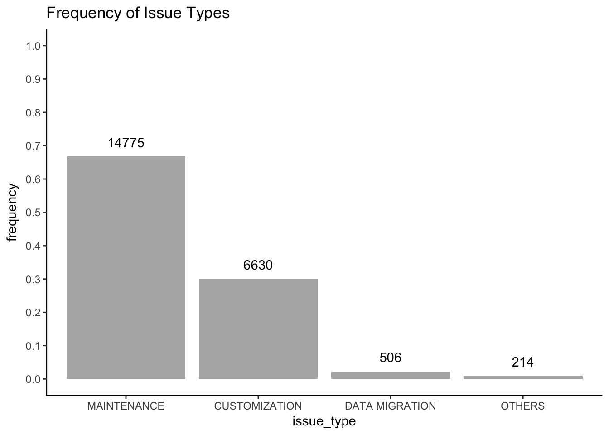

EDA in Issues Tracking Data Set
===============================

*by Dannyel Cardoso da Fonseca*

This project aims to explore a data set containing 22,125 observations
of issues tracking and their history logs. The data set represents 5
years of project management which aimed maintenance and customization of
many integrated systems.

A proprietary issue tracking system was used to manage activities of
teams. I used data wrangling techniques to export data from that and
clean them.

The final data set, used in this project, and its documentation can be
accessed, respectively, in these links:

-   [issues\_tracking.csv](issues_tracking.csv)
-   [issues\_tracking.Rdoc.txt](issues_tracking.Rdoc.txt)

The exported data set, the wrangling process scripts and an example of
one issue tracking can be find in [data\_wrangling](data_wrangling)
folder.

Summary of the Data Set
=======================

The issue data set contains 22,125 rows and 24 variables. Of these 24
variables 16 are about issue data and 8 about history records of a given
issue.

    ## 'data.frame':    22125 obs. of  24 variables:
    ##  $ issue_id             : int  487247 487247 ...
    ##  $ issue_number         : int  88374 88374 ...
    ##  $ issue_title          : chr  "Tarefa 88374 - Alteração de Finan"| __truncated__ ...
    ##  $ issue_type           : Factor w/ 4 levels "CUSTOMIZATION",..: 1 1 ...
    ##  $ issue_creation_date  : POSIXct, format: "2016-12-15 15:07:32" ...
    ##  $ issue_system         : Factor w/ 10 levels "INDEFINIDO","SERVICOS INTEGRADOS",..: 4 4 ...
    ##  $ issue_start_date     : Date, format: "2016-12-20" ...
    ##  $ issue_subsystem      : Factor w/ 77 levels "ADMINISTRAÇÃO",..: 34 34 ...
    ##  $ issue_deadline_date  : Date, format: "2017-01-03" ...
    ##  $ issue_created_by     : chr  "HELENA CLAUDIA DOS SANTOS TEIXEIRA" ...
    ##  $ issue_stakeholder    : Factor w/ 2 levels "COMPANY","CUSTOMER": 1 1 ...
    ##  $ issue_status         : Factor w/ 10 levels "CANCELED","CUSTOMER CLOSING PENDING",..: 3 3 ...
    ##  $ issue_time_spent     :Formal class 'Period' [package "lubridate"] with 6 slots
    ##  $ issue_priority_number: int  999 999 ...
    ##  $ issue_progress       : int  100 100 ...
    ##  $ issue_priority_scale : Factor w/ 6 levels "SUSPENDED","LOW",..: 4 4 ...
    ##  $ log_build_info       : chr  NA ...
    ##  $ log_creation_date    : POSIXct, format: "2017-04-10 17:07:00" ...
    ##  $ log_action           : Factor w/ 14 levels "CHANGE OF RESPONSIBILITY",..: 5 12 ...
    ##  $ log_status           : Factor w/ 34 levels "AUTHORIZED DEVELOPMENT",..: 7 4 ...
    ##  $ log_progress         : int  100 100 ...
    ##  $ log_time_spent       :Formal class 'Period' [package "lubridate"] with 6 slots
    ##  $ log_created_by       : chr  "ROSANGELA DIVINA DE SOUSA SANTANA" ...
    ##  $ log_svn_revision     : int  NA NA ...

    ## [1] "2013-05-21 19:10:24 UTC"

    ## [1] "2018-01-26 16:16:06 UTC"

The relationship between issue and log is 1-N, that is, one issue can
contains zero or more logs. In this project, the data set is
denormalized. The issue data and log data are joined in the same row.
Thus, one issue with three history logs has three rows in data set. In
*issue\_\** columns the data are repeated and in *log\_\** columns the
data are distinct (one for each issue log). The issue *15617*
illustrates this case in the table below.

    ##   issue_id issue_creation_date   log_creation_date
    ## 1    14416 2013-05-21 19:10:24 2013-06-13 16:32:00
    ## 2    15617 2013-06-07 18:01:29 2013-06-10 09:23:00
    ## 3    15617 2013-06-07 18:01:29 2013-06-13 10:37:00
    ## 4    15617 2013-06-07 18:01:29 2013-06-17 11:39:00
    ## 5    16281 2013-06-18 18:28:44 2013-06-20 15:35:00

Univariate Plots Section
========================

> **Tip**: In this section, you should perform some preliminary
> exploration of your dataset. Run some summaries of the data and create
> univariate plots to understand the structure of the individual
> variables in your dataset. Don’t forget to add a comment after each
> plot or closely-related group of plots! There should be multiple code
> chunks and text sections; the first one below is just to help you get
> started.

