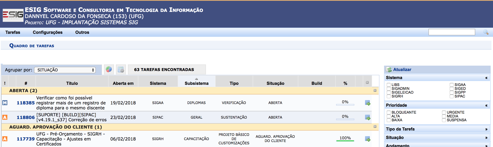

EDA in an Issues Tracking Data Set
==================================

*by Dannyel Cardoso da Fonseca*

This project aims to explore a data set containing 22,125 observations
of issues tracking and their history logs. The data set represents 5
years of project management which aimed maintenance and customization of
many integrated systems ([SIG](https://docs.info.ufrn.br)) for the
academic, administrative and human resources management at the
Universidade Federal de Goiás ([UFG](https://www.ufg.br)).

A proprietary issue tracking system
([SIGProject](https://sigproject.esig.com.br)) was used to manage
activities of teams.

I used data wrangling techniques to export data from that and clean
them. The final data set, used in this project, and its documentation
can be accessed, respectively, in these links:

-   [Issues Data Set](issues_tracking.csv)
-   [Issues Data Set Documentation](issues_tracking.Rdoc.txt)

The exported data set, the wrangling process scripts and an example of
one issue tracking can be find in [data\_wrangling](data_wrangling)
folder.

Data Set Summaries
==================

The issues data set contains 22,125 rows and 24 variables. Of these 24
variables 16 are about issue data and 8 about issue’s logs.

    ## 'data.frame':    22125 obs. of  24 variables:
    ##  $ issue_id             : int  487247 487247 ...
    ##  $ issue_number         : int  88374 88374 ...
    ##  $ issue_title          : chr  "Tarefa 88374 - Alteração de Finan"| __truncated__ ...
    ##  $ issue_type           : Factor w/ 4 levels "CUSTOMIZATION",..: 1 1 ...
    ##  $ issue_creation_date  : POSIXct, format: "2016-12-15 15:07:32" ...
    ##  $ issue_system         : Factor w/ 10 levels "INDEFINIDO","SERVICOS INTEGRADOS",..: 4 4 ...
    ##  $ issue_start_date     : Date, format: "2016-12-20" ...
    ##  $ issue_subsystem      : Factor w/ 77 levels "ADMINISTRAÇÃO",..: 34 34 ...
    ##  $ issue_deadline_date  : Date, format: "2017-01-03" ...
    ##  $ issue_created_by     : chr  "HELENA CLAUDIA DOS SANTOS TEIXEIRA" ...
    ##  $ issue_stakeholder    : Factor w/ 2 levels "COMPANY","CUSTOMER": 1 1 ...
    ##  $ issue_status         : Factor w/ 10 levels "CANCELED","CUSTOMER CLOSING PENDING",..: 3 3 ...
    ##  $ issue_time_spent     :Formal class 'Period' [package "lubridate"] with 6 slots
    ##  $ issue_priority_number: int  999 999 ...
    ##  $ issue_progress       : int  100 100 ...
    ##  $ issue_priority_scale : Factor w/ 6 levels "SUSPENDED","LOW",..: 4 4 ...
    ##  $ log_build_info       : chr  NA ...
    ##  $ log_creation_date    : POSIXct, format: "2017-04-10 17:07:00" ...
    ##  $ log_action           : Factor w/ 14 levels "CHANGE OF RESPONSIBILITY",..: 5 12 ...
    ##  $ log_status           : Factor w/ 34 levels "AUTHORIZED DEVELOPMENT",..: 7 4 ...
    ##  $ log_progress         : int  100 100 ...
    ##  $ log_time_spent       :Formal class 'Period' [package "lubridate"] with 6 slots
    ##  $ log_created_by       : chr  "ROSANGELA DIVINA DE SOUSA SANTANA" ...
    ##  $ log_svn_revision     : int  NA NA ...

The number of distinct issues rows and issue’s logs rows are 4,503 and
21,978 respectively.

    ##   number_issues number_logs
    ## 1          4503           0

We can note that the number of issues represents 20% of the data set and
the number of logs represents 99% of it. The 1% of logs remaining (147
rows) represents issues that do not have history logs.

The distribution of number of logs per issue and their summaries are
presented in the barplot below.

Analysing the plot above, we can note that 75% of issues have up to 6
history logs (before second black dotted line) and 50% of issues have
between 2 and 6 logs (between black dotted lines). Besides the skewed
shape of plot, the median (black dashed line) and mean (red solid line)
are very close. This means that the amount of ouliers (after gray dotted
line) is low, approximately 5% of issues.

This data set comprises issues created in the period between 05/21/2013
and 01/26/2018.

    ##   first_issue_creation_date last_issue_creation_date
    ## 1       05/21/2013 19:10:24      01/26/2018 16:16:06

The distribution of number of issues created by month and the cumulative
mean (red line) are presented in the barplot below.

Analysing the plot above, we note that the year 2013 had the lowest
demand. The accumulated mean (red solid line) variates between 10 and 20
issues per month. At the end of 2013 and begin of 2014 there was a drop
in activities because of the low administrative and academic activities
at the university in this period. From April of 2014 until February of
2015 there was significant growth in activities. The accumulated mean
increases from 10 to 70 issues per month. The accumulated mean overcame
the accumulated median and the distance between accumulated 3rd quartile
and accumulated median became greater than distance between accumulated
1st quartile and accumulated median. This means that theses months had a
high number of issues created in relation to the past.

But from August of 2015 the pace of growth dropped. Now, we can note
that the distance between accumulated 1st quartile and accumulated
median becomes greater than distance between accumulated 3rd quartile
and accumulated median. This invertion provocated the overlap between
accumulated mean and accumulated median. The stabilization of growth
also contributed to that. The average of growth pass to be only 10
monthly issues from February 2015.

We also note that except the significant growth period (April of 2014
until February of 2015) the months from September to December of each
year had a decline in activities. The reason is the low administrative
and academic activities at the university in this period. Thus, the
demand for the systems decreases.

To continue…

Reflections on Data Set Summaries
=================================

What is the commom flow of the log states? What makes the demand low in
2013? What makes the demand grow rapidly in 2014?
